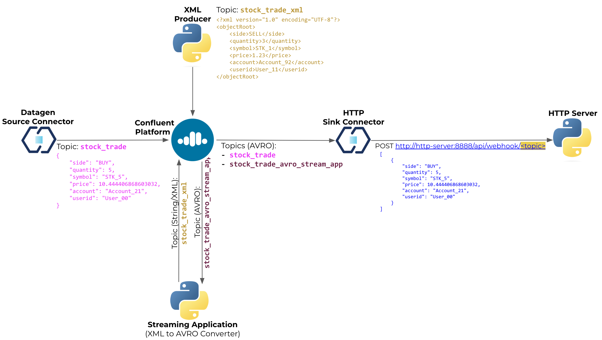
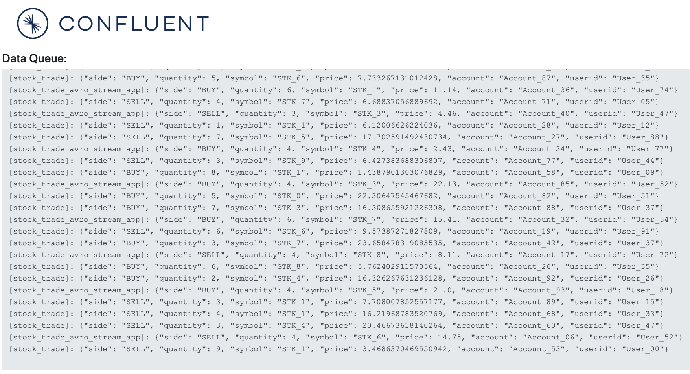

# http-sink-demo
Confluent Platform demo using Confluent HTTP Sink Connector.

This is a very simple demo where a [DataGen source connector](https://docs.confluent.io/kafka-connectors/datagen/current/overview.html) will product stock trade (dummy) data to the `stock_trade` topic and a [HTTP sink connector](https://docs.confluent.io/kafka-connectors/http/current/overview.html) will submit a webhook (POST request) to a remote HTTP Server. The data will not be batched, that is, for every event a POST request will be submitted, but that can be changed as it is a configuration parameter on the HTTP sink connector.

## Demo Diagram


## Requirements
- [curl](https://curl.se/)
- [Docker Desktop](https://www.docker.com/products/docker-desktop/)
- [Python 3.8+](https://www.python.org/)

## The Demo
This demo runs all on Docker. It will create two connectors:


### `datagen_stock_trade` (DataGen Source Connector)
It will publish stock trading (dummy) data at every 3 seconds to the topic `stock_trade` (.e.g `{"side": "BUY", "quantity": 5, "symbol": "STK_5", "price": 10.444406868603032, "account": "Account_21", "userid": "User_00"}`)


### `http_sink` (HTTP Sink Connector)
It will submit a POST request to `http://http-server:8888/api/webhook` for every message published to the topic `stock_trade`, but that connector can also be configured in a batched mode.


### HTTP Server
An HTTP server will process the POST requests sent to `http://http-server:8888/api/webhook` and have the data saved to a local in-memory queue. When accessing the server (http://localhost:8888) the messages will be off-loaded from the queue and displayed on a text box.

The HTTP Server, written in Python Flask, has three routes:
 - POST `/api/webhook`: Process POST requests (webhooks) from the HTTP sink connector. Every new message will be pushed to a local in-memory queue
 - GET `/`: Open the main page where the stock trade events will be displayed. That page will submit an AJAX request to `/get_data_queue` at every 500ms
 - GET `/get_data_queue`: Process AJAX GET request to off-load the queue and display the messages



## Running the demo
To automatically start the demo, run `./demo_start.sh`, once the docker images are downloaded, it should take less than 2 minutes to have everything up and running.
```
[+] Building 1.7s (10/10) FINISHED                                                                                                                                                                                                                                                             docker:desktop-linux
 => [http-server internal] load build definition from Dockerfile
 => => transferring dockerfile: 224B
 => [http-server internal] load .dockerignore
 => => transferring context: 2B
 => [http-server internal] load metadata for docker.io/library/python:3.8-slim-buster
 => [http-server 1/5] FROM docker.io/library/python:3.8-slim-buster@sha256:8799b0564103a9f36cfb8a8e1c562e11a9a6f2e3bb214e2adc23982b36a04511
 => [http-server internal] load build context
 => => transferring context: 927.37kB
 => CACHED [http-server 2/5] WORKDIR /src
 => CACHED [http-server 3/5] COPY src/requirements.txt requirements.txt
 => CACHED [http-server 4/5] RUN pip install --no-cache-dir -r requirements.txt
 => [http-server 5/5] COPY src/ .
 => [http-server] exporting to image
 => => exporting layers
 => => writing image sha256:f5435160a67b4b7e11659728ca6561e0f58d1bc05ed87ecbf6420659e2811cab
 => => naming to docker.io/library/
[+] Running 7/7
 ✔ Network http-sink-demo_default  Created
 ✔ Container http-server           Started
 ✔ Container zookeeper             Started
 ✔ Container broker                Started
 ✔ Container schema-registry       Started
 ✔ Container control-center        Started
 ✔ Container connect               Started

Waiting Schema Registry to be ready...
Waiting Schema Registry to be ready...
Waiting Schema Registry to be ready...
Waiting Schema Registry to be ready...
Waiting Schema Registry to be ready...
Waiting Schema Registry to be ready...

Waiting Connect Cluster to be ready...
Waiting Connect Cluster to be ready...
Waiting Connect Cluster to be ready...
Waiting Connect Cluster to be ready...
Waiting Connect Cluster to be ready...
Waiting Connect Cluster to be ready...
Waiting Connect Cluster to be ready...
Waiting Connect Cluster to be ready...

Creating Datagen connector (Stock Trading)
HTTP/1.1 201 Created
Date: Thu, 14 Mar 2024 13:47:39 GMT
Location: http://localhost:8083/connectors/datagen_stock_trade
Content-Type: application/json
Content-Length: 1108

{"name":"datagen_stock_trade","config":{"connector.class":"io.confluent.kafka.connect.datagen.DatagenConnector","key.converter":"org.apache.kafka.connect.storage.StringConverter","kafka.topic":"stock_trade","schema.string":"{\"namespace\": \"ksql\", \"name\": \"StockTrade\", \"type\": \"record\", \"fields\": [{\"name\": \"side\", \"type\": {\"type\": \"string\", \"arg.properties\": {\"options\": [\"BUY\", \"SELL\"]}}}, {\"name\": \"quantity\", \"type\": {\"type\": \"int\", \"arg.properties\": {\"range\": {\"min\": 1, \"max\": 10}}}}, {\"name\": \"symbol\", \"type\": {\"type\": \"string\", \"arg.properties\": {\"regex\": \"STK_[0-9]\"}}}, {\"name\": \"price\", \"type\": {\"type\": \"double\", \"arg.properties\": {\"range\": {\"min\": 1, \"max\": 25}}}}, {\"name\": \"account\", \"type\": {\"type\": \"string\", \"arg.properties\": {\"regex\": \"Account_[0-9]{2}\"}}}, {\"name\": \"userid\", \"type\": {\"type\": \"string\", \"arg.properties\": {\"regex\": \"User_[0-9]{2}\"}}}]}","max.interval":"3000","iterations":"10000000","tasks.max":"1","name":"datagen_stock_trade"},"tasks":[],"type":"source"}
Creating HTTP Sink connector
HTTP/1.1 201 Created
Date: Thu, 14 Mar 2024 13:47:42 GMT
Location: http://localhost:8083/connectors/http_sink
Content-Type: application/json
Content-Length: 971

{"name":"http_sink","config":{"topics":"stock_trade","tasks.max":"1","connector.class":"io.confluent.connect.http.HttpSinkConnector","request.method":"post","auth.type":"NONE","http.api.url":"http://http-server:8888/api/webhook","headers":"Content-Type:application/json","key.converter":"org.apache.kafka.connect.storage.StringConverter","value.converter":"io.confluent.connect.avro.AvroConverter","value.converter.schema.registry.url":"http://schema-registry:8081","value.converter.schemas.enable":"false","request.body.format":"json","batch.max.size":"1","batch.prefix":"","batch.json.as.array":"true","confluent.topic.bootstrap.servers":"broker:9094","confluent.topic.replication.factor":"1","reporter.bootstrap.servers":"broker:9094","reporter.result.topic.name":"success-responses","reporter.result.topic.replication.factor":"1","reporter.error.topic.name":"error-responses","reporter.error.topic.replication.factor":"1","name":"http_sink"},"tasks":[],"type":"sink"}

Datagen connector status (Stock Trading)
{"name":"datagen_stock_trade","connector":{"state":"RUNNING","worker_id":"connect:8083"},"tasks":[{"id":0,"state":"RUNNING","worker_id":"connect:8083"}],"type":"source"}

HTTP Sink connector status
{"name":"http_sink","connector":{"state":"RUNNING","worker_id":"connect:8083"},"tasks":[{"id":0,"state":"RUNNING","worker_id":"connect:8083"}],"type":"sink"}

Demo environment is ready!
```

At the end of the start up script, it will open the following web pages:
 - Confluent Control Center: http://localhost:9021
 - HTTP Server: http://localhost:8888

## Stopping the demo
To stop the demo, please run `./demo_stop.sh`.

```
[+] Running 7/7
 ✔ Container connect               Removed
 ✔ Container control-center        Removed
 ✔ Container http-server           Removed
 ✔ Container schema-registry       Removed
 ✔ Container broker                Removed
 ✔ Container zookeeper             Removed
 ✔ Network http-sink-demo_default  Removed 
 ```

## External References
Check out [Confluent's Developer portal](https://developer.confluent.io), it has free courses, documents, articles, blogs, podcasts and so many more content to get you up and running with a fully managed Apache Kafka service.

Disclaimer: I work for Confluent :wink: